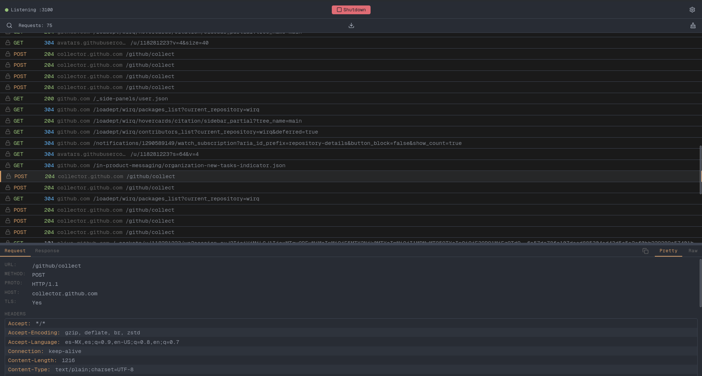
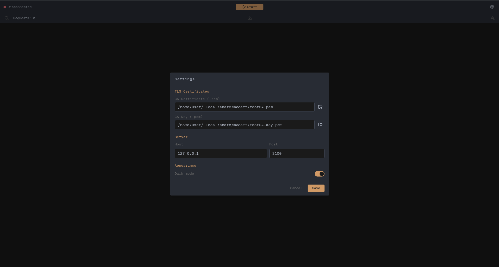
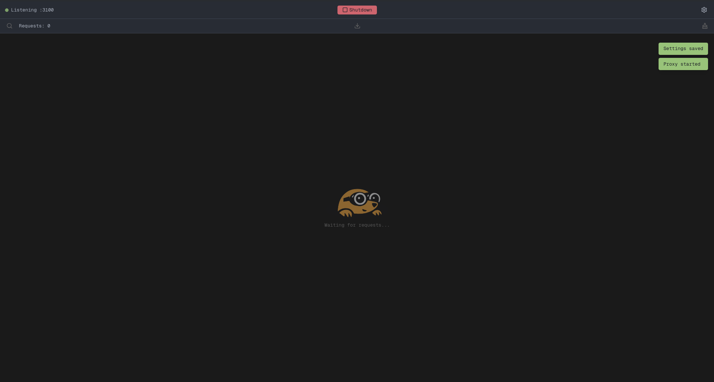
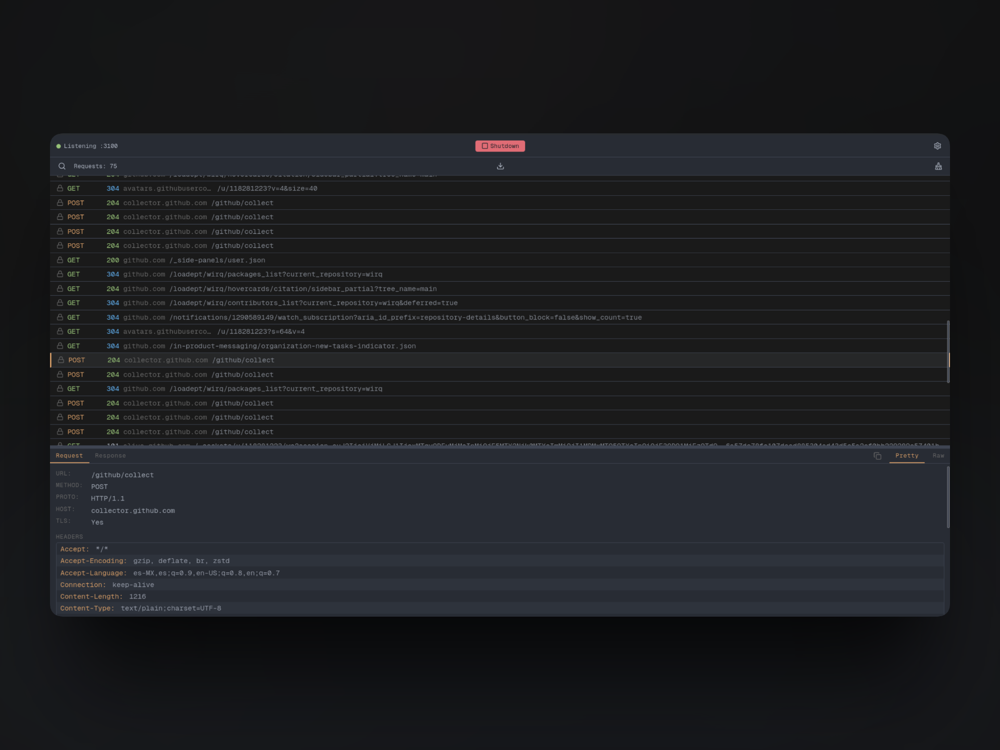

<div align="center">


<h1>wirq</h1>
<p>
    A local MITM proxy for inspecting HTTP/HTTPS traffic.
</p>
<p>
    <a href="https://wirq.loadept.com">🌐 Homepage</a> &nbsp;|&nbsp;
    <a href="https://github.com/loadept/wirq">💻 GitHub</a> &nbsp;|&nbsp;
    <a href="LICENSE">📄 AGPL-3.0</a>
</p>

[](https://github.com/loadept/wirq/actions/workflows/ci.yml)

</div>



## Features

- Intercepts HTTP and HTTPS (CONNECT) traffic in real time
- Inspects request and response headers, bodies, and status codes
- Decompresses gzip, brotli, and zstd response bodies automatically
- Truncates large text bodies at 10 KB for readability
- Dark / light theme
- Single-instance lock (re-focuses existing window)

## Prerequisites

- [Go](https://go.dev) 1.26+
- [Bun](https://bun.sh)
- [Wails CLI v2](https://wails.io) — install with `go install github.com/wailsapp/wails/v2/cmd/wails@latest`
- **Linux**: requires `webkit2gtk-4.1` (build tag `webkit2_41`)

## Quick start

```bash
git clone https://github.com/loadept/wirq
cd wirq

# Run in development mode (live reload)
# On Linux: append -tags webkit2_41
wails dev
```

The app window will open. If no certificates are configured, the settings modal appears automatically. Follow the [Usage Guide](#usage-guide) below to get started.

## Usage Guide

### Step 1: Install mkcert

mkcert creates a local CA trusted by your system. Install it for your platform:

<details>
<summary><b>Windows</b></summary>

```bash
# Using WinGet (Windows 10/11)
winget install mkcert

# Or using Chocolatey
choco install mkcert
```

</details>

<details>
<summary><b>macOS</b></summary>

```bash
# Using Homebrew
brew install mkcert
```

</details>

<details>
<summary><b>Linux (Debian/Ubuntu)</b></summary>

```bash
# Install dependencies
sudo apt install libnss3-tools

# Using the install script
curl -JL https://dl.filippo.io/mkcert/latest?for=linux/amd64 -o mkcert
chmod +x mkcert
sudo mv mkcert /usr/local/bin/

# Or via your package manager (if available)
# brew, apt, pacman, etc.
```

</details>

### Step 2: Generate CA certificates

Run the following commands to create a local CA and find the generated files:

```bash
# Create a local CA trusted by your system
mkcert -install

# Find where the PEM files were saved
mkcert -CAROOT
```

The output tells you where your CA files are:

| Platform | Path |
|---|---|
| Windows | `%LOCALAPPDATA%\mkcert` |
| macOS | `~/Library/Application Support/mkcert` |
| Linux | `~/.local/share/mkcert` |

You'll find two files there:

| File | Description |
|---|---|
| `rootCA.pem` | CA certificate — this is what your OS/browser trusts |
| `rootCA-key.pem` | CA private key — used by wirq to sign intercepted certs |

### Step 3: Configure wirq

1. Open wirq. The **Settings** modal appears automatically on first run.
2. Click the folder icon next to **CA Certificate** and select `rootCA.pem`.
3. Click the folder icon next to **CA Key** and select `rootCA-key.pem`.
4. Optionally adjust the **Host** and **Port** (default: `127.0.0.1:3100`).
5. Click **Save**.



### Step 4: Start the proxy

Click the **Start** button in the top. The status indicator will turn green when the proxy is running.



### Step 5: Configure your browser or system

Point your browser or system to use wirq as an HTTP proxy:

<details>
<summary><b>System-wide (Windows)</b></summary>

1. Open **Settings** → **Network & Internet** → **Proxy**
2. Under **Manual proxy setup**, click **Edit**
3. Enable **Use a proxy server**
4. Set **Address** to `127.0.0.1` and **Port** to `3100`
5. Click **Save**

</details>

<details>
<summary><b>System-wide (macOS)</b></summary>

1. Open **System Settings** → **Network** → select your connection
2. Click **Details** → **Proxies**
3. Enable **Web Proxy (HTTP)** and **Secure Web Proxy (HTTPS)**
4. Set both to `127.0.0.1:3100`
5. Click **OK**

</details>

<details>
<summary><b>System-wide (Linux — GNOME)</b></summary>

```bash
# Set proxy via gsettings
gsettings set org.gnome.system.proxy mode 'manual'
gsettings set org.gnome.system.proxy.http host '127.0.0.1'
gsettings set org.gnome.system.proxy.http port 3100
gsettings set org.gnome.system.proxy.https host '127.0.0.1'
gsettings set org.gnome.system.proxy.https port 3100
```

</details>

<details>
<summary><b>Firefox</b></summary>

1. Open **Settings** → scroll to **Network Settings**
2. Select **Manual proxy configuration**
3. Set **HTTP Proxy** to `127.0.0.1`, **Port** `3100`
4. Check **Also use this proxy for HTTPS**
5. Click **OK**

> **Note:** Firefox uses its own certificate store. To intercept HTTPS in Firefox, import `rootCA.pem` into Firefox's **Certificate Authorities** (Settings → Privacy & Security → Certificates → View Certificates → Authorities → Import).

</details>

<details>
<summary><b>Chrome / Edge / Chromium</b></summary>

These browsers use the OS certificate store, so if you ran `mkcert -install`, they'll trust intercepted HTTPS out of the box. Just set the proxy address to `127.0.0.1:3100`.

</details>

<details>
<summary><b>curl</b></summary>

```bash
# Use wirq as proxy for a single request
curl -x http://127.0.0.1:3100 https://example.com

# Or set it for the session
export http_proxy=http://127.0.0.1:3100
export https_proxy=http://127.0.0.1:3100
curl https://example.com
```

</details>

### Step 6: Inspect traffic

Once configured, any request going through the proxy appears in wirq in real time:

1. Click any entry in the **request list** to see full details.
2. Switch between **Request** and **Response** tabs.
3. Use the **filter** to search by method, host, URL, status code, or regex (e.g. `method:POST status:200`).
4. Right-click entries to **Export** selected logs as JSON.



## CA Certificates

wirq is a MITM proxy and needs a **CA certificate pair** (PEM) to dynamically generate TLS certificates for intercepted hosts. It does **not** generate its own CA — you provide one.

The recommended way is with [mkcert](https://github.com/FiloSottile/mkcert) (see [Step 1](#step-1-install-mkcert) above).

Once you have the files, load them into wirq's settings:

| Field | Value |
|---|---|
| Cert Path | `$(mkcert -CAROOT)/rootCA.pem` |
| Cert Key Path | `$(mkcert -CAROOT)/rootCA-key.pem` |

## Development

| Action | Command |
|---|---|
| Dev mode (live reload) | `wails dev` (Linux: `wails dev -tags webkit2_41`) |
| Go tests | `gotestsum --format testname -- -race ./internal/...` |
| Lint / format frontend | `bun run --bun biome check --write frontend/src/` |
| Frontend standalone (Vite) | `cd frontend && bun run dev` |
| Add frontend dependency | `cd frontend && bun add <pkg>` |

## Build

```bash
# On Linux: append -tags webkit2_41
wails build
```

The binary is written to `build/bin/wirq`.

```bash
./build/bin/wirq --version
```

## Configuration

wirq stores its configuration at:

- **Linux**: `~/.config/wirq/config.json`
- **macOS**: `~/Library/Application Support/wirq/config.json`
- **Windows**: `%AppData%/wirq/config.json`

Default values:

```json
{
  "server": { "host": "127.0.0.1", "port": 3100 },
  "general": { "appearance": "dark" }
}
```

## License

This project is licensed under the [GNU Affero General Public License v3.0](LICENSE).
